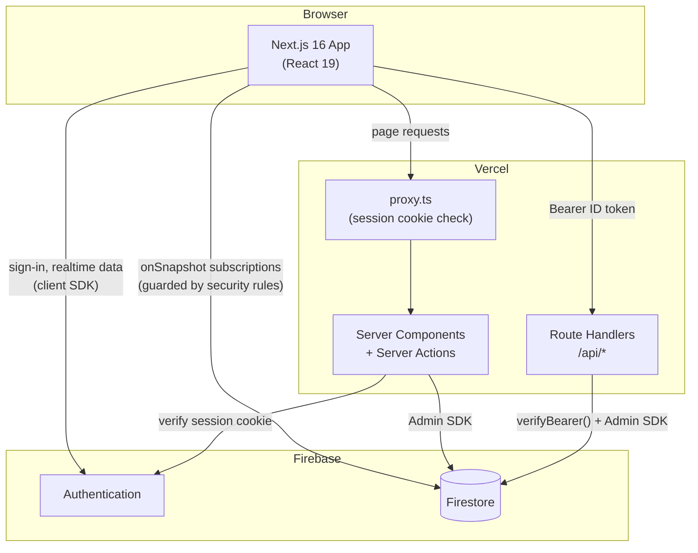
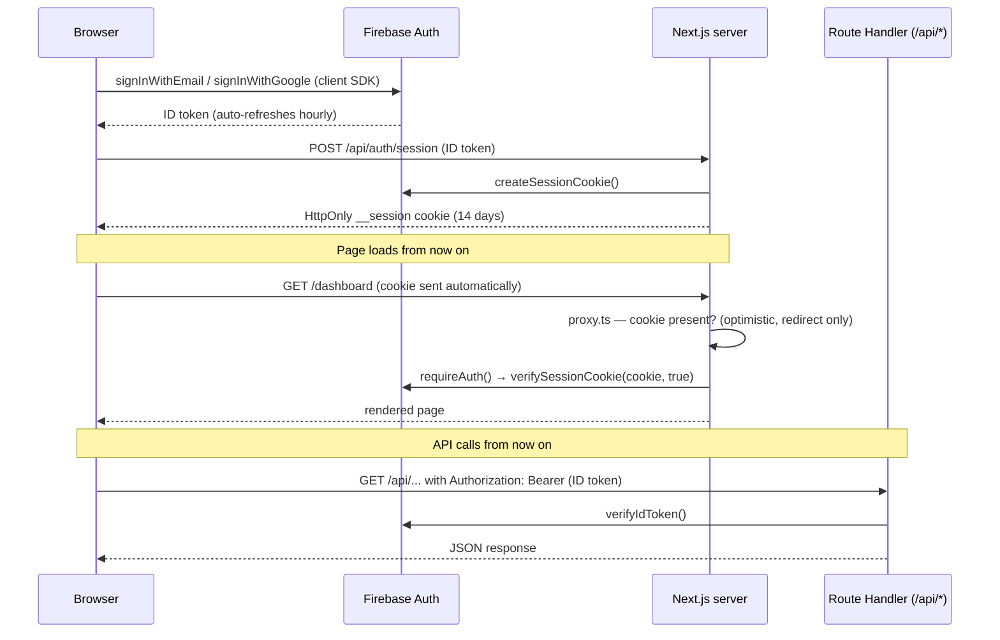

# Architecture

## System Overview

The system has two parts: a **Next.js app** (deployed to Vercel) that is both the UI and the backend — Server Components, Server Actions and Route Handlers — and **Firebase services** (Auth, Firestore). There's no local emulator — the app always talks to a real Firebase project (use a free project for local dev).

The frontend is server-rendered (Server Actions, `proxy.ts`, `/api/auth/session`), so it needs a server host. It deploys to Vercel's free Hobby tier rather than Firebase Hosting, since Firebase Hosting's SSR integration runs on Cloud Functions/Cloud Run and requires Blaze even at zero traffic — Vercel doesn't.



Three paths to the data, each with its own guard:

| Path                                       | Used for                                              | Guarded by                                    |
| ------------------------------------------ | ----------------------------------------------------- | --------------------------------------------- |
| Browser → Firestore (client SDK)           | Real-time subscriptions in Client Components          | **Firestore security rules**                  |
| Browser → Server Component / Server Action | SSR pages, mutations                                  | **`requireAuth()`** (verifies session cookie) |
| External caller → Route Handler (`/api/*`) | Webhooks, other clients, anything needing an HTTP URL | **`verifyBearer()`** (verifies ID token)      |

## Authentication Flow



**Critical:** the cookie check in `proxy.ts` is optimistic (presence only) — it exists to redirect signed-out users, not to enforce security. Cryptographic verification always happens server-side near the data: `requireAuth()` in Server Actions/Components, `verifyBearer()` in Route Handlers.

## Request Patterns

### Server-rendered page (Server Component)

1. Browser requests `/dashboard`
2. `proxy.ts` checks the `__session` cookie → redirects to `/auth/signin` if absent
3. Server Component calls `requireAuth()`, then fetches Firestore data via the Admin SDK
4. HTML is streamed to the browser

### Client-side real-time data

1. Client Component mounts
2. `useCollection()` hook subscribes to Firestore via `onSnapshot`
3. UI updates live as data changes — Firestore security rules enforce access

### Mutation (Server Action)

1. Client Component calls a Server Action
2. Action calls `requireAuth()`, validates input with Zod, writes via the Admin SDK
3. Returns `ActionResult<T>` — `{ success, error?, data? }`

### API call (Route Handler)

1. Caller obtains a Firebase ID token: `user.getIdToken()`
2. Caller sends `Authorization: Bearer {token}` to `/api/...`
3. The handler calls `verifyBearer(req)` and returns `unauthorized()` if it is null
4. It validates input with Zod, queries Firestore via the Admin SDK, and responds — errors via `problem()` (RFC 9457)

## Backend Structure

There is no separate backend server — the Next.js app on Vercel is the backend:

```
frontend/src/
├── actions/               requireAuth(), getServerSession() — session-cookie auth
├── features/*/actions/    Server Actions — every read and write the UI makes
├── app/api/*/route.ts     Route Handlers — HTTP endpoints (/api/health, /api/me, /api/auth/session)
└── lib/
    ├── firebase/admin.ts  Admin SDK (server-only)
    └── api/               verifyBearer() (ID-token auth), problem() (RFC 9457 errors)
```

Use a Server Action for anything the app's own UI does. Add a Route Handler only when something outside the UI needs an HTTP URL.

## Security Model

- **Firestore rules** — last line of defence; always assume clients are untrusted
- **Route Handlers** — call `verifyBearer()` (verifies the ID token) in every protected route
- **Next.js Server Actions** — call `requireAuth()` (verifies session cookie via Admin SDK) before any data operation
- **proxy.ts** — optimistic cookie check only; used for redirects, never for security

See `docs/SECURITY.md` for the full layered security reference.

## Key Design Decisions

**Why session cookies instead of just Firebase client auth?**
Next.js route interception (`proxy.ts`) runs on a lightweight runtime and cannot use the Firebase Admin SDK. The session cookie gives it a cheap signal for redirects. Cryptographic trust is established server-side near the data.

**Why feature-based folder structure?**
Features in `frontend/src/features/{feature}/` are self-contained — types, hooks, actions, and components together. Deleting a feature means deleting one folder. Cross-feature imports are explicit violations of the intended boundary.

**Why no separate backend (Express / Cloud Functions)?**
Server Actions and Route Handlers deploy with the frontend as Vercel Functions on the free tier, share types with the UI, and need no CORS or extra deploy. Cloud Functions would also require Firebase's paid Blaze plan.
